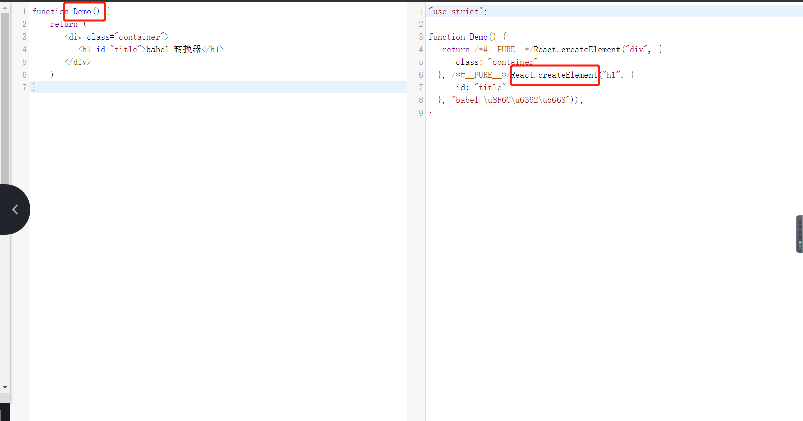

JSX 语法规则：

* 定义虚拟 DOM 时，不要写引号
* 标签中混入 JS 表达式时要用{}
* 标签的类名指定不要用class，要用className
* 内联样式，要用style={{key:value}}的形式去写
* 只有一个根标签
* 标签必须闭合
* 标签首字母
  * 若小写字母开头，则将该标签转为 html 中同名元素，若 html 中没有该标签对应的同名元素，则报错
  * 若大写字母开头，react 就去渲染对应的组件，若组件没有定义，则报错

<hr/>

函数式组件

执行了 ReactDOM.render(<Demo/>, document.getElementById("container")); 之后，发生了什么？

* React 解析组件标签，找到 Demo 组件
* 发现组件是使用函数定义的，随后调用该函数，将返回的虚拟DOM转成真实DOM，随后呈现在页面中

<hr/>

类式组件

执行了 ReactDOM.render(<Demo/>, document.getElementById("container")); 之后，发生了什么？

* React 解析组件标签，找到 Demo 组件
* 发现组件是使用类定义的，随后创建该组件的实例对象（new Demo()）,并通过该实例调用到原型上的 render 方法。
* 将返回的虚拟DOM转成真实DOM，随后呈现在页面中

<hr/>

babel、函数式组件、React.createElement() 三者之间的关系

```javascript
function Demo() {
   return (
     <div class="container">
       <h1 id="title">babel 转换器</h1>
     </div>
   )
}
```

