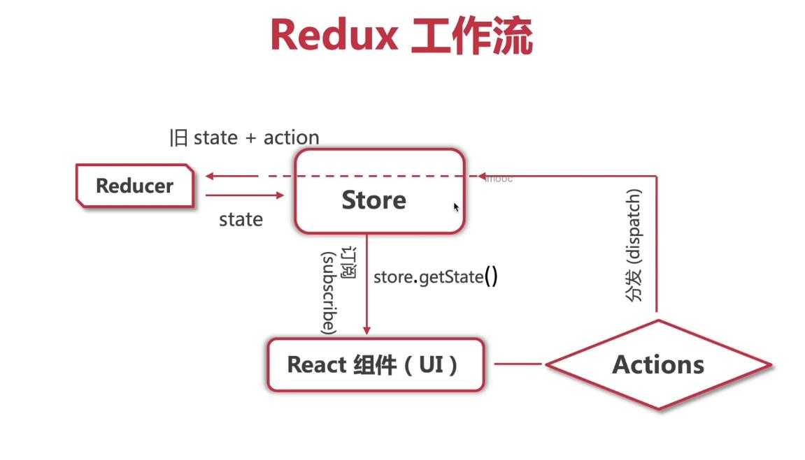
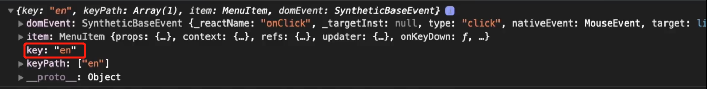
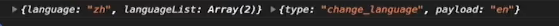

## Redux

### 一、redux 工作流



### 二、创建 redux

> npm install redux

* `src/redux/languageReducer.ts`  数据处理逻辑 

  ```ts
  // 数据类型
  export interface LanguageState {
      language: "en" | "zh"
      languageList: { name: string,  code: string }[]
  }
  
  // 默认数据
  const defaultState : LanguageState = {
      language: "zh",
      languageList: [
          { name: "中文", code: "zh" },
          { name: "English", code: "en" }
      ]
  };
  
  export default = (state = defaultState, action) => {
      // console.log(state, action) 输出结果看下图
      
      switch(action.type) {
          case "change_labguage":
              return {...state, language: action.payload}
          default: 
              return state
      } 
  }
  ```

  > 注：
  >
  > * **参数 state 是旧数据**
  >
  > * 在 redux 中 **不能直接修改参数 state** , 其 state 是 `immutable`（不可修改的），需要将参数 state 赋值给一个新对象，在该新对象对状态进行修改。

* `src/redux/store.ts` （数据仓库 store）

  ```tsx
  import { createStore } from "redux"
  // 数据处理逻辑
  import languageReducer from './languageReducer'
  
  const store = createStore(languageReducer)
  
  // 通过动态获取 store 数据仓库中的数据，并读取变量类型
  export type RootState = ReturnType<typeof store.getState>
                                     
  export default store
  ```

<br/>

### 三、在类组件中使用 redux

> 这里使用了高阶函数，可以使用，也可以不使用

1、自定义高阶函数 withRouter

```tsx
// 路由钩子函数
import { 
    useNavigate, NavigateFunction, 
    useParams, ParamsFunction,
    useLocation, LocationFunction
} from "react-router-dom"

// 最终通过 withRouter 函数处理后，返回的数据类型有哪些？
export interface RouteComponentProps {
   navigate: NavigateFunction
   params:  ParamsFunction,
   location: LocationFunction
}
export const withRouter = (Component) => {
    const Wrappper = (props) => {
        
        const navigate = useNavigate()
        const params = useParams()
        const location = useLocation()
        
        return <Component navigate={navigate} params={params} location={location} {...props}></Component>
    }
    return Wrapper
}
```

> `Wrappper` 是函数式组件，故可以使用到 **react-router-dom@v6** 中的钩子函数，并将其钩子函数通过 `props` 传入到 **Component** 中

<br/>

2、将 header 组件封装成高阶函数，并使用 store 数据仓库

```tsx
import React from 'react'

// 导入自定义好的高阶函数
import { withRoute, RouteComponentProps } from '@/helpers/withRouter'

// 导入 store 仓库
import store from "@/src/redux/store"

/*
  定义 state 的数据类型，由于在此案例中，是将 store 中的数据放入到 state. 
  故 将 store 中定义的数据类型进行导出，state 继承 LanguageState
*/
import { LanguageState } from "@/src/redux/languageReducer"
interface State extends LanguageState {}

class HeaderComponent extends React.Component<RouteComponentProps, State> {
    constructor(props) {
        super(props)
        // 获取 store 数据仓库
        const storeState = store.getState()
       
        // 使用 store 数据（将其放入到 state）
        this.state = {
            language: storeState.language,
            languageList: storeState.languageList
        }
        
        // 订阅 store （当 store 数据发生改变时，会执行回调函数）
        store.subscribe(() => {
            // 重新去 store 取出新数据
            const newState = store.getState()
            this.setState({
                language: newState.language,
                languageList: newState.languageList
            })
        })
    }
    render() {
        // 使用路由信息（通过自定义高阶函数传递过来的路由信息）
        const { navigate } = this.props
        return (
            <div className="header">
                <Dropdown.Button
                    overlay={ <Menu 
                                onClick={() => {this.menuClickHander}}  
                                items={this.state.languageList.map(l => { key: l.code, label: l.name })} /> 
                            }
                > { this.state.language === "zh" ? "中文", "English" }
                </Dropdown.Button>
            </div>
        )
    } 
    // 修改 state 数据参数
    menuClickHander = (e) => {
        // console.log(e)  
        // this.setState({ language: e.key})
        const action = {
            type: "change_language",
            payload: e.key
        }
        
        // 向仓库分发修改 language 的指令
        store.dispatch(action)
    }
}

// 通过高阶函数处理后，导出
export const Header = withRoute(HeaderComponent)
```

* 事件对象 e

  

* `this.setState({ language: e.key})`： 采用这种方式修改数据，也可以让数据修改，UI 也会进行同步。但数据仓库没有进行同步。

* `store.dispatch(action)`：在 `src/redux/languageReducer.ts` 中的方法输出内容为

  

<br/>

### 四、在类组件中使用 react-redux

> npm install redux
>
> npm install react-redux
>
> npm install @types/react-redux --save-dev
>
> https://react-redux.js.org/introduction/getting-started

1、入口文件 index.tsx

```tsx
import React from 'react'
import ReactDOM from 'react-dom'
import App from './App'
import { Provider } from 'react-redux'
import store from './redux/store'
ReactDOM.render(
    <React.StrictMode store={store}>
        <App />
    </React.StrictMode>,
    document.getElementById('root')
)
```

> 此步操作目的是在全局范围内可以操作 redux

2、header 组件

```tsx
import React from 'react'

import { withRoute, RouteComponentProps } from '@/helpers/withRouter'

import { RootState } from "@/src/redux/store"

import { connect } from 'react-redux'
import { Dispatch } from 'redux'

// 将 store 中的 数据注入到 props
const mapStateToProps = (state: RootState) => {
    return {
        language: state.language,
        languageList: state.languageList
    }
}

// 将 dispatch 导入到 props 
const mapDispatchToProps = (dispatch: Dispatch) => {
    return {
        changeLanguage: (code: "zh" | "en") => {
            const action = {
                  type: "change_language",
                  payload: code
            }
            dispatch(action)
        }
    }
}

type PropsType = 
RouteComponentProps // react-router 路由 props 类型
& 
ReturnType<typeof mapStateToProps> // redux store 类型
&
ReturnType<typeof mapDispatchToProps> // redux dispatch 类型
         
class HeaderComponent extends React.Component<PropsType> {
    render() {
        const { navigate } = this.props
        return (
            <div className="header">
                <Dropdown.Button
                    overlay={ <Menu 
                                onClick={() => {this.menuClickHander}}  
                                items={this.props.languageList.map(l => { key: l.code, label: l.name })} /> 
                            }
                > { this.props.language === "zh" ? "中文", "English" }
                </Dropdown.Button>
            </div>
        )
    } 
    // 修改 state 数据参数
    menuClickHander = (e) => {
      this.props.changeLanguage(e.key)
    }
}

export const Header = connect(mapStateToProps, mapDispatchToProps)(withRoute(HeaderComponent))
```

3、 **react-redux** 与 **redux** 对比

* redux：是直接原有的 api；react-redux：是在 redux 的基础上进行封装，操作起来更方便
* redux：在哪个组件要使用时，则导入 store；react-redux：可以实现全局导入，任何地方都可以使用
* react-redux：更适合目前开发的流程

<br/>

### 五、在函数式组件中使用 react-redux

1、入口文件 index.tsx

```tsx
import React from 'react'
import ReactDOM from 'react-dom'
import App from './App'
import { Provider } from 'react-redux'
import store from './redux/store'
ReactDOM.render(
    <React.StrictMode store={store}>
        <App />
    </React.StrictMode>,
    document.getElementById('root')
)
```

2、header 组件

```tsx
import React from 'react'
import { RootState } from "@/src/redux/store"

// 钩子函数
import { useSelector, useDispatch } from 'react-redux'

const Header : React.FC = () => {
    
    // 获取store数据
    const language = useSelector((state : RootState) => state.language)
    const languageList = useSelector((state : RootState) => state.languageList)
    const dispatch = useDispatch()
    
    const menuClickHander = (e) => {
        const action = {
            type: "change_language",
            payload: e.key
        }
        dispatch(action)
    }
    
    return (
        <div className="header">
                <Dropdown.Button
                    overlay={ <Menu 
                                onClick={() => {menuClickHander}}  
                                items={languageList.map(l => { key: l.code, label: l.name })} /> 
                            }
                > { language === "zh" ? "中文", "English" }
                </Dropdown.Button>
        </div>
    )
}
```

<br/>

### 六 redux 中包含多个 Reducer

```ts
import { createStore, combineReducers } from "redux"
// 数据处理逻辑
import languageReducer from './languageReducer'
import productReducer from './productReducer'
const rootReducer = combineReducers({
    language: languageReducer,
    product: productReducer
})
const store = createStore(rootReducer)

// 通过动态获取 store 数据仓库中的数据，并读取变量类型
export type RootState = ReturnType<typeof store.getState>
                                   
export default store
```

```tsx
// 使用
  const languageList = useSelector((state : RootState) => state.language.languageList)
```

<br/>

### 七  redux 中间件 redux-thunk 

> npm install redux-thunk
>
> 作用：将 api 请求封装到 redux action 中，页面只需要通过 action 即可获取到数据

```ts
import { createStore, combineReducers, applyMiddleware } from "redux"
// 数据处理逻辑
import languageReducer from './languageReducer'
import productReducer from './productReducer'
import thunk from 'redux-thunk'
const rootReducer = combineReducers({
    language: languageReducer,
    product: productReducer
})
const store = createStore(rootReducer, applyMiddleware(thunk))

// 通过动态获取 store 数据仓库中的数据，并读取变量类型
export type RootState = ReturnType<typeof store.getState>
                                   
export default store
```

创建 action

```ts
import { ThunkAction } from 'redux-thunk'
import { RootState } from './store'
import axios from 'axios'
export getDataActionCreator = () : ThunkAction<viod, RootState, unknown,  any> => async(dispatch, getState) {
     try {
         // 获取数据
         const { data } = await axios.get('localhost:3000/api')
     } catch(error) {
         // 错误处理
     }
}
```

页面

```tsx
import React from 'react'
import { getDataActionCreator } from './getDataActionCreator'

import { RootState } from "@/src/redux/store"

import { connect } from 'react-redux'
import { Dispatch } from 'redux'

// 将 store 中的 数据注入到 props
const mapStateToProps = (state: RootState) => {
    return {
        language: state.language,
        languageList: state.languageList
    }
}

// 将 dispatch 导入到 props 
const mapDispatchToProps = (dispatch: Dispatch) => {
    return {
       getData: () => {
           dispatch(getDataActionCreator())
       }
    }
}
    
class Home extends React.Component<PropsType> {
    componentDidMount() {
        this.props.getData()
    }
    render() {
        return (
            <div></div>
        )
    } 
}

export const Header = connect(mapStateToProps, mapDispatchToProps)(Home)
```

